# raenest-agent

Self-contained Node codebase that plays **Raenest Run** (the lane-runner at `fun.raenest.com`) on a local server with a deterministic in-page driver, and posts **large-margin all-time leaderboard wins** for a chosen role. No LLM, no model downloads — the "brain" is a compact heuristic injected into the game page itself.

## Quick start

```bash
cd ai-agent-raenest-game
npm install
node src/play.mjs            # config.json defaults: beat <role> all-time top × 1.2, post under config name
```

Artifacts (all in `out/`):

| file | content |
|---|---|
| `play-<ts>.log` | live run log (progress every ~15 s, target hits, crash retries, post result) |
| `report-<ts>-a<n>.json` | final report: score, target, all-time, margin, distance/level/stops, post status, crash forensics, last 80 trace frames, config echo |
| `run-<ts>-a<n>.png` | screenshot of the game-over card |

Exit codes: `0` target met or all-time beaten · `3` finished without meeting target · `1` fatal error.

## Configuration

`config.json` (every key has a CLI override):

| key | default | meaning |
|---|---|---|
| `name` | `"c0d33ngr"` | name posted to the leaderboard |
| `role` | `freelancer` | `freelancer` · `remote` · `founder` · `spender` |
| `city` | `lagos` | `lagos` · `abuja` · `accra` · `nairobi` · `cairo` · `manila` |
| `port` | `8322` | local game server port |
| `apiBase` | `https://fun.raenest.com` | leaderboard API base |
| `video.enabled` | `false` | record the whole session (menu → runs → over-card → post) to `out/video/run-<ts>.mp4` |
| `video.fps` | `10` | recording frame rate (needs `ffmpeg` on PATH) |
| `video.quality` | `70` | JPEG capture quality 0–100 (fed to h264) |
| `target.mode` | `beat_all_time` | `beat_all_time` · `score` (fixed) · `until_crash` (no cap) |
| `target.margin` | `0.2` | beat all-time top by 20 % (used with `beat_all_time`) |
| `target.score` | — | fixed target (used with `score`) |
| `retries` | `5` | attempts per invocation: a natural crash restarts the run until the target is hit or attempts run out |
| `run.maxSeconds` | `0` | hard cap per attempt (0 = none); forces a controlled end when hit |
| `browser.executablePath` | auto-detect | Chrome/Chromium path (`which` candidates: google-chrome, chromium, msedge…) or `RAENEST_CHROME` env |
| `browser.headless` | `true` | `--headful` runs with a visible window |
| `browser.userDataDir` | `out/profile` | persisted browser profile: keeps the player `fingerprint` (stable leaderboard identity) and local bests |
| `post.enabled` | `true` | enter the name and click Post in the game's over-card |

CLI flags: `--name --role --city --margin --target-mode --target --retries --max-seconds --port --headful --no-post --profile <dir> --video [--video-fps N] --no-video`

Examples:

```bash
node src/play.mjs --role founder --margin 0.3            # beat founder all-time by 30 %
node src/play.mjs --target 200000 --retries 2            # fixed target
node src/play.mjs --video --video-fps 15              # record the whole session to out/video/*.mp4
node src/play.mjs --target-mode until_crash --no-post    # let nature decide, keep leaderboard clean
npm run smoke                                             # 2–4 min self-test: reach 1200 pts, no post
npm run board                                             # live all-time/top-5 + today per role
node src/leaderboard.mjs freelancer                       # one role only
```

## How it works

```mermaid
flowchart LR
  A[game/raenest.html<br>pristine] -->|src/hook.js| P[patch.mjs]
  P --> B[out/raenest.patched.html]
  B --> S[server.mjs :8321<br>+ /api/scores proxy]
  S --> C[headless Chrome<br>puppeteer-core]
  C --> D[driver autoStep<br>every animation frame]
  D -->|score ≥ target| F[__forceCrash → 'over']
  D -->|collision| F
  F --> G[enter name → #postBtn]
  G --> H[POST /api/scores]
  H --> I[report + screenshot]
```



- **`game/raenest.html`** — the original game, kept pristine. It is the patcher input; never edit it.
- **`src/hook.js`** — the driver. Injected at the tail of the game's main IIFE, so it shares the game's closure (`state`, `lane`, `objs`, `score`, `start`, …). Runs every animation frame while `state === 'play'`:
  1. per-lane **time-to-collision** (TTC) from visible obstacles (collision band `COLBAND = 140 px`),
  2. value **attraction**: stop `+400`, power-up `+150`, coin `+6` (each gated on that lane's TTC),
  3. stability bias: current lane `+22`, center lane `+2`,
  4. switches to the highest-scoring lane instantly.
  Exposed automation API: `window.__start()`, `window.__gstate()` (state/lane/score/dist/level/v/shield/carrying/role/city/best), `window.__forceCrash()` (zeroes the shield, then ends the run with a genuine collision — the stop is guaranteed even mid-power-up), `window.__trace` (lane/target/TTC/score every 4 frames, capped at 600), `window.__crash` (full obstacle snapshot at the frame of death).
- **`src/patch.mjs`** — regenerates `out/raenest.patched.html` from pristine source + hook. Asserts the IIFE-tail anchor occurs exactly once and refuses double-patching, so it fails loudly if the upstream game changes.
- **`src/server.mjs`** — serves the patched game at `/` and proxies `/api/scores` → `apiBase` (strips hop headers, adds CORS). The game therefore needs no internet for anything except the leaderboard; kill the network mid-run and the run keeps playing — only the final post waits for it.
- **`src/play.mjs`** — the agent: resolve target (`all-time top × (1+margin)` via the board API) → patch → serve → launch Chrome (persisted profile so the player fingerprint is stable across runs) → seed `rn-run-role` / `rn-run-city` / `rn-run-name` into localStorage **before** the game script runs → `__start()` → poll `__gstate()` every 250 ms → **target hit ⇒ controlled crash to lock in the margin** → natural crash ⇒ **post that attempt's score, then retry** up to `retries` → final report: **every attempt that reaches the over-card is posted** (the leaderboard keeps the player's best, so a high early attempt stays on the board even if later ones crash); the report lists all attempts with their scores.
- **`src/leaderboard.mjs`** — board client + CLI (`npm run board`).
- **`src/post.mjs`** — re-post a finished run directly (after a failed in-page post): `node src/post.mjs --report out/report-<ts>-a1.json` (the report carries name/role/city/fingerprint/score). Same fingerprint = same leaderboard identity; the server keeps the player's best.
Driver tuning knobs (in `src/hook.js`): `COLBAND`, `CAP`, TTC weight `* 0.5`, lane-stay `+22`, center bias, attraction weights/distance windows, trace sample rate.

## Leaderboard API

```
GET  {apiBase}/api/scores?role=<role>&period=<today|week|all>&city=<city|all>
     -> { rows: [ { player_key, name, city, score }, ... ] }   # best-first, one row per player

POST {apiBase}/api/scores
     body { fingerprint, name, role, city, score }
     -> { ok, player_key, rankToday }  |  { ok:false, code }
```

All-time reference (2026-10-01, verify live with `npm run board`):
freelancer **373,754** · founder **1,201,518** · remote **53,071** · spender **30,410**.

## Protocol for an agent with its own browser tool

(No runner needed — drive the page directly.)

1. `npm install && node src/patch.mjs && node src/server.mjs` (serves on the config port).
2. Open `http://127.0.0.1:<port>/`. Before the game script runs (or via the menu buttons), set localStorage `rn-run-role`, `rn-run-city`, `rn-run-name`.
3. `window.__start()`.
4. Poll `window.__gstate()` every 250–500 ms: `{ state, lane, score, dist, stops, coinsGot, level, v, shield, carrying, role, city, best }`.
5. End the run when `score ≥ target` with `window.__forceCrash()`, or let a collision do it (`state` → `'over'`).
6. On `'over'` (the card appears ~750 ms after the crash): set `#nameIn`.value and click `#postBtn`. Button reads `Posted` ⇒ success; `Try again` ⇒ post failed (usually network) ⇒ re-post with `node src/post.mjs --report <report.json>` once the network is back.
7. Forensics: `window.__crash` (obstacles at death), `window.__trace` (decision log).

## Troubleshooting

- **`patch.mjs` anchor error** — the upstream game HTML changed; find the last `requestAnimationFrame(frame);` right before the IIFE `})();` in `game/raenest.html` and update `ANCHOR` in `src/patch.mjs`.
- **Browser launch / CDP error** — Chrome vs puppeteer-core version mismatch: set `browser.executablePath` (or `RAENEST_CHROME`) to a compatible Chrome, or `npm i puppeteer-core@latest`.
- **Run stalls with `state: pause`** — the game auto-pauses on `document.hidden` (laptop sleep). `play.mjs` auto-resumes; avoid sleeping the machine mid-run.
- **Network flaps mid-run** — gameplay is 100 % local; only the final post needs the API. A failed post is safe to replay later via `src/post.mjs`.
- **New identity** — delete `out/profile` (the persisted fingerprint + local bests live there).
- **Video** — `--video` / `video.enabled` needs `ffmpeg` on PATH (records via Chrome's CDP screencast → h264 mp4 at 430×900, ~3–8 MB/min at 10 fps). Without ffmpeg the run continues without video (noted in the log).
- **Long runs** — expect hours for large-margin targets; run under `tmux`/`nohup`, watch `out/play-<ts>.log`.
